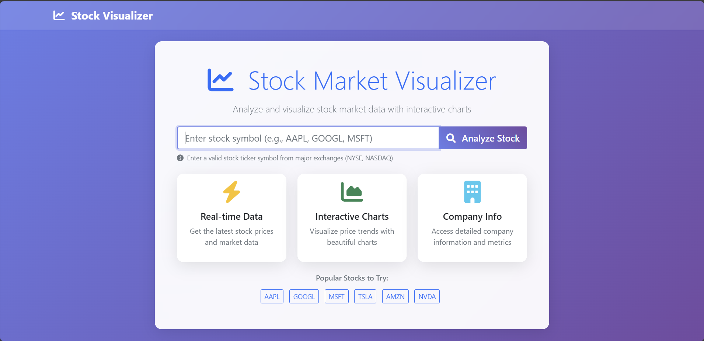

# Stock Visualization Website

A Flask-based web application for visualizing stock market data using the Alpha Vantage API.




## Installation

1. **Clone or download the project**
   ```bash
   cd MarketDash
   ```

2. **Create a virtual environment**
   ```bash
   python -m venv venv
   venv\Scripts\activate  # On Windows
   # source venv/bin/activate  # On macOS/Linux
   ```

3. **Install dependencies**
   ```bash
   pip install -r requirements.txt
   ```

4. **Set up environment variables**
   - Get your free API key from [Alpha Vantage](https://www.alphavantage.co/support/#api-key)
   - Replace with your actual API key in the `.env` file

5. **Run the application**
   ```bash
   python app.py
   ```

6. **Open your browser**
   Navigate to `http://localhost:5000`

## API Key Setup

1. Go to [Alpha Vantage](https://www.alphavantage.co/support/#api-key)
2. Sign up for a free account
3. Get your API key
4. Add it to your `.env` file:
   ```
   ALPHA_VANTAGE_API_KEY=YOUR_ACTUAL_API_KEY
   ```
